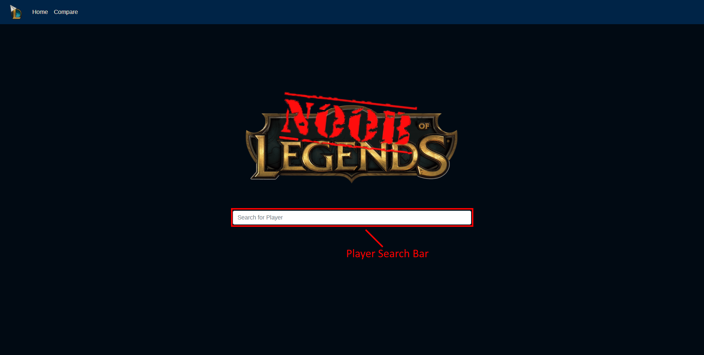
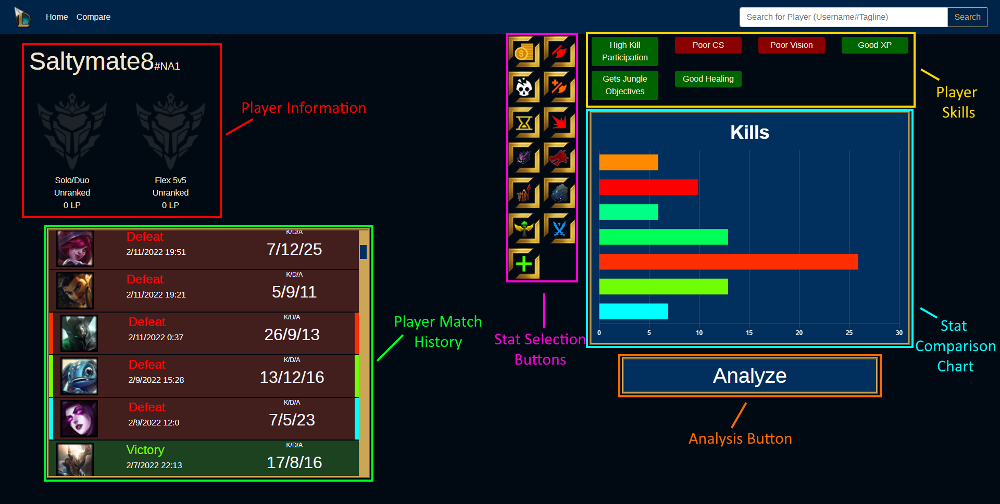
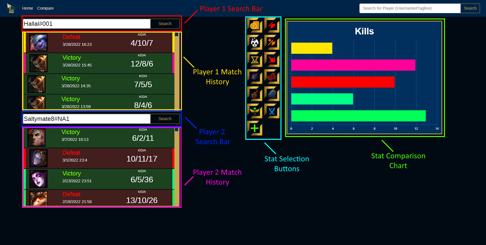

<div id="top"></div>

<!-- PROJECT LOGO -->
<br />
<div align="center">
  <h1>Noob of Legends</h1>

  <h3 align="center">League of Legends analytics and learning</h3>
</div>

<!-- TABLE OF CONTENTS -->
<details>
  <summary>Table of Contents</summary>
  <ol>
    <li>
      <a href="#about-the-project">About The Project</a>
      <ul>
        <li><a href="#built-with">Built With</a></li>
      </ul>
    </li>
    <li>
      <a href="#getting-started">Getting Started</a>
      <ul>
        <li><a href="#prerequisites">Prerequisites</a></li>
        <li><a href="#optional-but-recommended-counterparts">Optional but recommended counterparts</a></li>
        <li><a href="#installation">Installation</a></li>
        <li><a href="#building-and-running">Building and Running</a></li>
      </ul>
    </li>
    <li><a href="#usage">Usage</a></li>
    <li><a href="#deployment">Deployment</a></li>
  </ol>
</details>


<!-- ABOUT THE PROJECT -->
## About The Project

Noob of Legends is a player resource application for League of Legends players that will allow users to gain insights into their gameplay statistics. Unlike other player resource apps, Noob of Legends provides a thorough examination of user statistics and allow players to compare their own statistics with those of other players. The application also provides curated suggestions on areas where players could improve their gameplay. The goal of this project  is to develop a functional and useful application within an extremely limited time constraint of only 3 months.

<p align="right">(<a href="#top">back to top</a>)</p>


### Built With

* [ASP.NET](https://dotnet.microsoft.com/en-us/apps/aspnet/)
* [React.js](https://reactjs.org/)
* [Bootstrap](https://getbootstrap.com)

<p align="right">(<a href="#top">back to top</a>)</p>


<!-- GETTING STARTED -->
## Getting Started

Before you can build this project yourself, you will need to install a few prerequisites if you don't already have them installed.

### Prerequisites

The following prerequisites are required before you can build and run the application.

* Node.js and npm
     - Install the latest LTS version of Node.js and npm: 
<a href="https://nodejs.org/en/">Download here</a>.

* IIS Express
     - IIS Express is not be included on most windows computers by default. To download and enable it: 
         1. Open the Start menu.
         2. Type features and select Turn Windows features on or off.
         3. Check the Internet Information Services checkbox and hit OK.
         4. Wait for the installation to complete and hit Close.

* Visual Studio
     - You will be able to edit, build and run the app from both Visual Studio and Visual Studio Code but in order for VS Code to build the app, an instance of Visual Studio must be installed on your computer.
     - Install the 2022 version of Visual Studio Community from: <a href='https://visualstudio.microsoft.com/downloads/'>here</a>
     - Once you have downloaded the installer, you want to ensure that you install the following workload:
         - ASP.NET and web development
     - Also ensure that the following individual components are installed:
         - .NET 6.0 Runtime


### Optional but recommended counterparts

* Postman
     - Postman is a powerful tool for testing API endpoints. You will have to signup to use their services but there is a free plan: <a href='https://www.postman.com/product/api-client/'>Check it out here</a>

* Microsoft SQL Server Management Studio
     - Microsoft's SQL Server Management Studio allows you to manage local databases. This is incredibly useful for debugging databases.
     - Follow this great tutorial to install: <a href='https://www.youtube.com/watch?v=CqpURYqK_wU'>Tutorial Here</a>
     - Coming Eventually: A tutorial on how to create a database for use in this project. (this will be added later)

### Installation

Below are the instructions to install the project.

1. Clone the repo
   ```sh
   git clone https://github.com/TeeganKrieger/Noob-Of-Legends.git
   ```
(More instructions may be added if something changes)

### Building and Running

First of all, We high recommend using Visual Studio Community over Visual Studio Code, however, instructions are provided for both.

Before building and running, ensure you follow the Creating a Database and Connecting to a database instructions inside the <a href="/NoobOfLegends-BackEnd/DATABASE.md">Database.md</a> file.

* Visual Studio Community

     1. Open the solution (.sln) file included within the project.
     2. Ensure that both projects are set as startup projects. To do this, right click the solution file in the project explorer, click properties, navigate to startup project and set the action of both the frontend and backend to "Start". 
     3. Click the build button (f5) at the top of the visual studio window
     4. Both the Frontend and Backend applications will run. 

* Visual Studio Code

    1. Open two instances of Visual Studio Code.
    2. In the first instance, open the Frontend project folder. In the second instance, open the Backend project folder.
    3. Go to the Run and Debug tab on both instance. On the Frontend instance, ensure that you select the "Launch with Node" configuration. For the Backend instance, ensure that you select the ".NET Core Launch" (web) configuration.
    4. Finally, Run the Backend application first, then run the Frontend application.

* Additional Notes:
     - If you are using Visual Studio Community and working on Backend code, in some cases, changes you make can be "Hot Reloaded" (Meaning they are recompiled without having to restart the application). To do this, simply click the Hot Reload button next to the Run button.
     - Regardless of which editor you are using, Frontend code such as javascript, html and css should automatically reload upon refreshing the page without the need for a program restart. If changes are not appearing, try doing a hard refresh (typically ctrl + f5 on most browsers).

<p align="right">(<a href="#top">back to top</a>)</p>


<!-- USAGE EXAMPLES -->
## Usage 

The Noob Of Legends Application allows for users to lookup their own or other player’s profiles and view ranked information and recent matches. Users will also be able to select groups of matches to be analyzed by our skill analysis system, which will provide users with a list of skills they 
could be making improvements upon, as well as providing links to useful guides these players could consult. 

Starting Noob of Legends will present you with the home page. The home page provides a search functionality, allowing users to input a Riot Game's username and tagline and fetch results about that player.



Performing a search will bring you to the player profile page, where a player's ranking information and match history will be displayed. The Player Profile also allows for the selection of matches for the purpose of comparing statistic and for the analysis of those matches. By selecting matches from the match list, these matches will be displayed in the stat comparison chart on the right. When a user clicks the analyze button under the chart, skill analysis will be performed. Skills a player could improve upon will be displayed above the chart.



Another feature of the application is the Player Comparison Page. In similarity to the Player Profile page, users can search for two different users with the search functionality which will then display the player's recent matches. These matches can also be selected and compared using the stat comparison chart. This page serves the purpose of doing direct comparisons between different players.



<p align="right">(<a href="#top">back to top</a>)</p>
